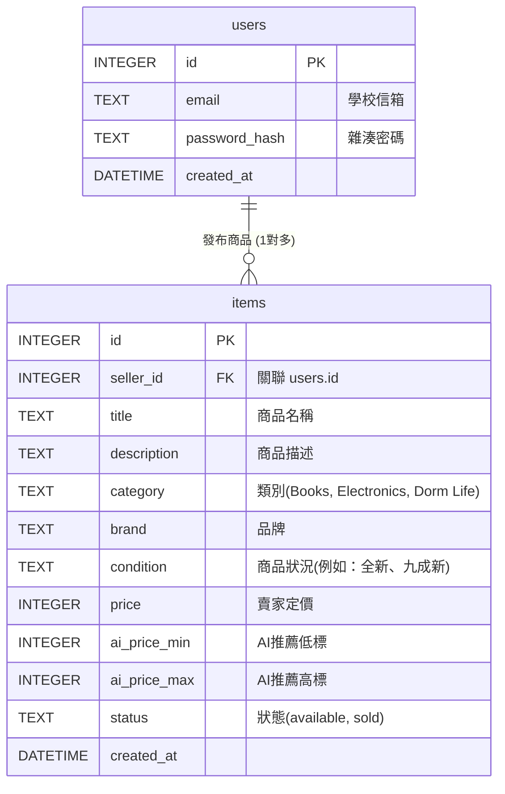

# 資料庫設計 (Database Design)

本文件依據 PRD 與架構設計，定義 CampuSwap 的 SQLite 資料表結構、關聯與欄位說明。為保持 MVP 單純，目前僅規劃 `users` 與 `items` 兩個核心資料表。

## 1. 實體關係圖 (ER 圖)

## 2. 資料表詳細說明

### 2.1 使用者資料表 (`users`)
負責儲存使用者的基本資料與認證資訊。

| 欄位名稱 | 型別 | 必填 | 說明 |
| -------- | ---- | ---- | ---- |
| `id` | INTEGER | 是 | Primary Key，自動遞增 |
| `email` | TEXT | 是 | 使用者的學校信箱，需唯一 (UNIQUE) |
| `password_hash` | TEXT | 是 | 經過雜湊處理的密碼，避免明文儲存 |
| `created_at` | DATETIME | 否 | 帳號建立時間，預設為 `CURRENT_TIMESTAMP` |

### 2.2 商品資料表 (`items`)
儲存使用者發布的商品資訊，包含供搜尋與過濾使用的中繼資料，以及 AI 估價結果。

| 欄位名稱 | 型別 | 必填 | 說明 |
| -------- | ---- | ---- | ---- |
| `id` | INTEGER | 是 | Primary Key，自動遞增 |
| `seller_id` | INTEGER | 是 | Foreign Key，關聯至 `users.id`，代表發布者 |
| `title` | TEXT | 是 | 商品名稱 |
| `description` | TEXT | 否 | 商品的詳細描述 |
| `category` | TEXT | 是 | 商品分類 (Books, Electronics, Dorm Life 等) |
| `brand` | TEXT | 否 | 商品品牌 (供 AI 估價參考) |
| `condition` | TEXT | 是 | 商品狀況 (供 AI 估價參考) |
| `price` | INTEGER | 是 | 賣家最終決定的販售價格 |
| `ai_price_min`| INTEGER | 否 | AI 建議的價格區間下限 |
| `ai_price_max`| INTEGER | 否 | AI 建議的價格區間上限 |
| `status` | TEXT | 是 | 商品狀態 (`available` 或 `sold`)，預設 `available` |
| `created_at` | DATETIME | 否 | 商品發布時間，預設為 `CURRENT_TIMESTAMP` |

## 3. SQL 建表語法

請參考專案中的 `database/schema.sql` 檔案。

## 4. Python Model 說明

資料表將對應至 `app/models/` 目錄下的 Python 模組：
- **`app/models/user.py`**: 提供 `create()`, `get_by_email()`, `get_by_id()` 等函式。
- **`app/models/item.py`**: 提供 `create()`, `get_all()`, `search_and_filter()`, `get_by_id()`, `update_status()`, `delete()` 等函式。特別是 `search_and_filter()` 將實作 F-04 核心功能的邏輯。
